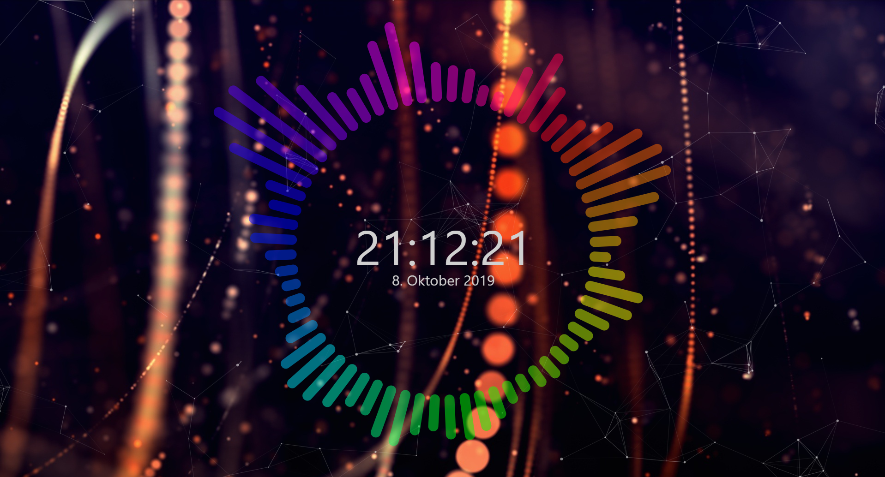
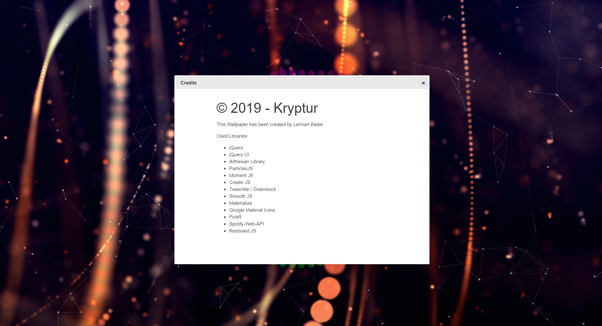
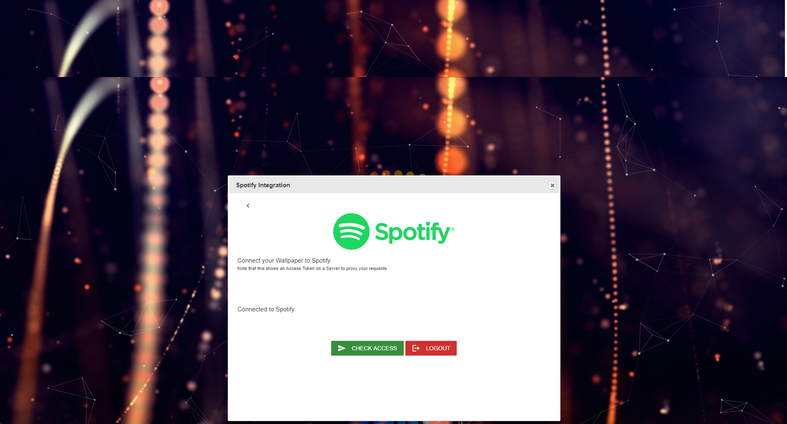
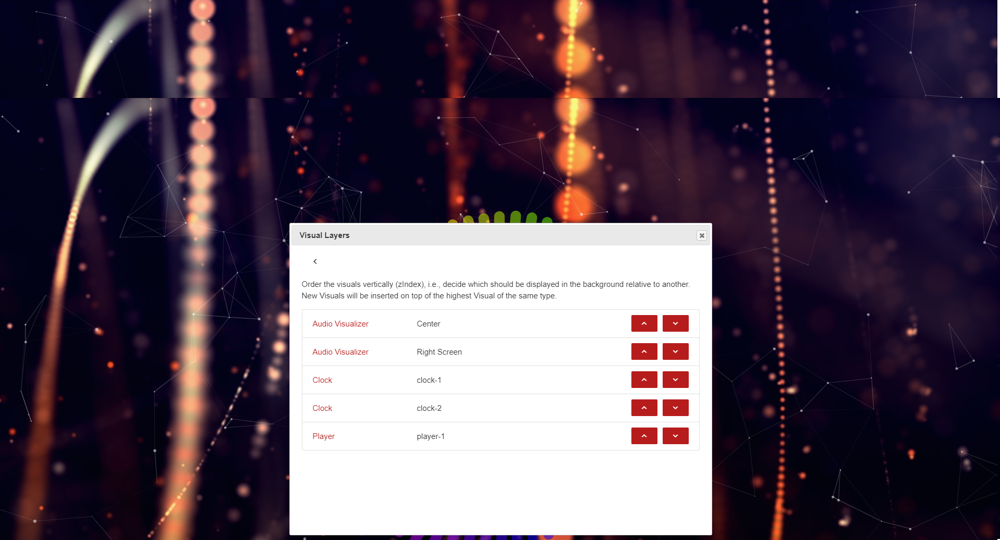
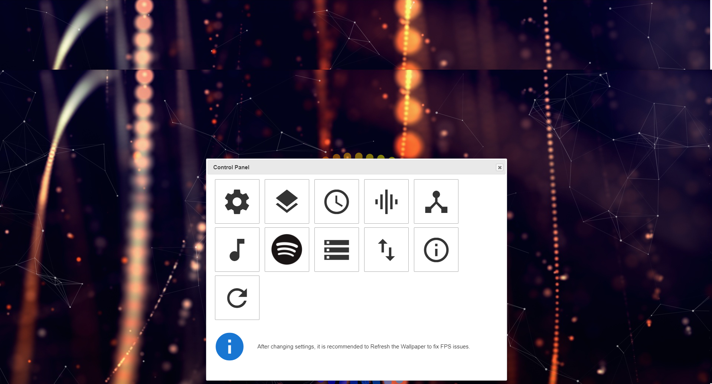

# Wallpaper Engine Visualizer
## Features
* Audio Visualizer
* Clock
* Spotify Integration
* Particle Background
* Integrated Control Panel (No Wallpaper Engine Configuration Options needed)

## Screenshots

